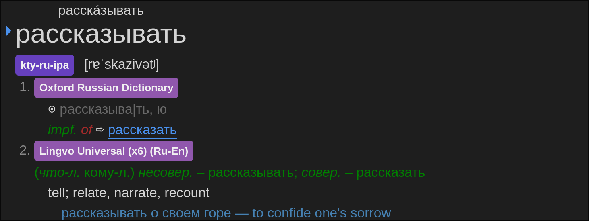

# Lingvo Universal Russian-English Dictionary

|  |  |
| :----------------------------------: | :------------------------------: |
|            GoldenDict-ng             |             Yomitan              |

## Description

A good complement to the
[Oxford Russian Dictionary](https://github.com/yuukibarns/Oxford-Russian-4th),
Lingvo often provides definitions that differ from those in the Oxford
dictionary. Moreover, as shown in the screenshots above, it frequently gives
definitions for the opposite verb aspect (perfective/imperfective) compared to
Oxford. For example, Lingvo defines "рассказывать" while Oxford defines
"рассказать" Therefore, when Oxford only provides a cross-reference for a
particular aspect, we can easily check Lingvo instead of following the
cross-reference.

## Usage

Run `1.py` to generate the `term_bank_1.json` file, then use

```sh
zip test.zip index.json term_bank_1.json
```

to create the `test.zip` file for importing into Yomitan.

(_Note._ You can directly use the generated `test.zip` file.)

## Source

The DSL dictionary file is from the
[FreeMdict Forum](https://forum.freemdict.com/t/topic/12213/2), and the original
source is [Словариум](https://dic.1963.ru/560). If you visit the website, you
can find the latest maintained Lingvo dictionary (updated as of 07/05/2025),
though it requires a subscription. The DSL dictionary file used in this repo is
the 2021 version, and I haven't figured out how to get a subscription to access
the latest dictionary. If anyone has a more updated version, please consider
making a PR.
